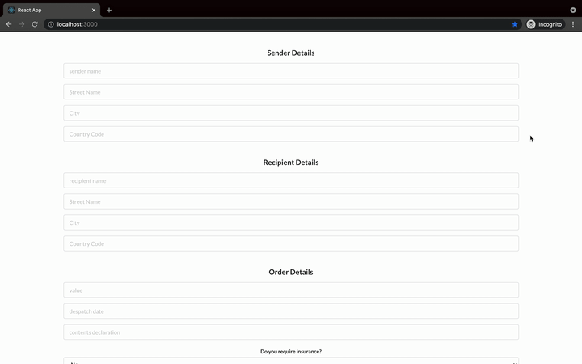

# JoinedUp-backend

[]

## Backend (Flask)

$ git clone [https://github.com/TomNewton1/JoinedUp-backend.git](https://github.com/TomNewton1/JoinedUp-backend.git)

change in to project directory

$ cd JoinedUp-backend

start virtual environment

$ source venv/bin/activate

install requirements

$ pip install -r requirements.txt

run the server (this will run on port 5000)

$ flask run

## Frontend (React)

The frontend repository can be found at: https://github.com/TomNewton1/JoinedUp-frontend

In a seperate directory clone the repository

$ git clone [https://github.com/TomNewton1/JoinedUp-frontend.git](https://github.com/TomNewton1/JoinedUp-frontend.git)

change in to project directory

$ cd JoinedUp-frontend

$ npm install 

$ npm start

the server will run on port 3000
